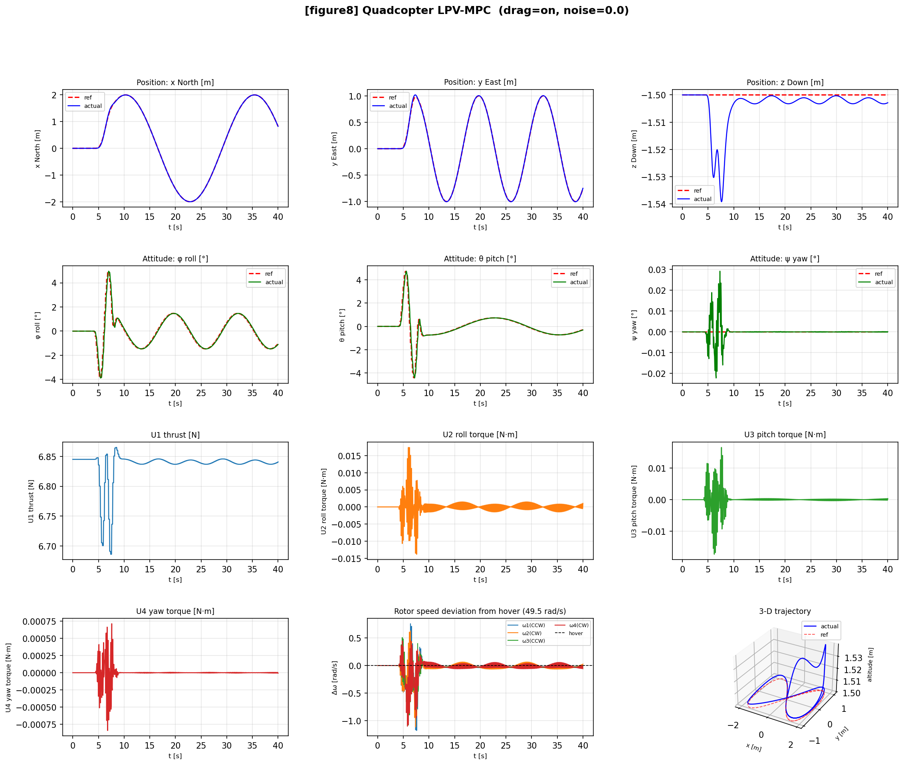
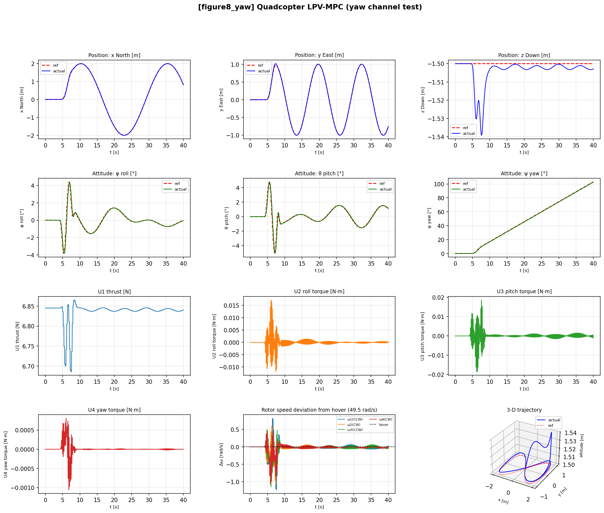
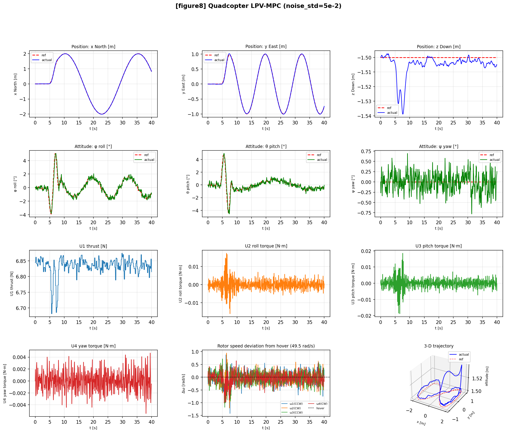

# quadrotor-feedback-linearization-lpv-mpc
6-DOF quadrotor simulation with a two-level cascade controller: feedback linearisation outer loop for position tracking and qLPV-MPC inner loop for attitude control. Built on full Newton-Euler dynamics, RK4 integration, aerodynamic drag, and gyroscopic rotor coupling. Validated on figure-8, yaw-sweep, and noise robustness scenarios.

---

## Technical Deep Dive & Mathematical Formulation

---

### 1. Outer Loop — Feedback Linearisation (Position Control)

The translational dynamics of the quadrotor in the North-East-Down (NED) world
frame are inherently nonlinear and fully coupled by the attitude channels:

```
x_ddot = (U1/m)(cos(psi)*sin(theta)*cos(phi) + sin(psi)*sin(phi))
y_ddot = (U1/m)(sin(psi)*sin(theta)*cos(phi) - cos(psi)*sin(phi))
z_ddot =  g - (U1/m)(cos(theta)*cos(phi))
```

#### Virtual Control and Error Dynamics

To decouple the system, a virtual control vector `v = [vx, vy, vz]` is
introduced as desired world-frame accelerations. A PD tracking law with
feedforward acceleration is applied per axis:

```
v_i = x_ref_ddot_i  +  k2_i * (x_ref_dot_i - x_dot_i)
                     +  k1_i * (x_ref_i     - x_i    )
```

This reduces the plant to three independent double integrators (`x_ddot_i = v_i`),
yielding stable second-order error dynamics:

```
e_ddot  +  k2_i * e_dot  +  k1_i * e  =  0
```

#### Gain Design via Pole Placement

Matching the characteristic polynomial `(s - p1)(s - p2) = s^2 + k2*s + k1`:

```
k1 = Re(p1 * p2)        (proportional gain)
k2 = -Re(p1 + p2)       (derivative gain)
```

Both gains are positive when poles have strictly negative real parts.
Default poles used in simulation:

```
x, y axes :  -1.5 +/- 0.5j   ->  wn = 1.58 rad/s,  zeta = 0.95
z axis    :  -2.0 +/- 0.3j   ->  wn = 2.02 rad/s,  zeta = 0.99
```

The z-axis poles are slightly more aggressive because altitude is decoupled
from roll/pitch and does not risk saturating the inner loop.

#### Exact Angle Inversion (No Small-Angle Assumption)

Unlike simplified models that assume `cos(phi), cos(theta) ≈ 1`, this
implementation uses an exact geometric inversion. The required thrust
magnitude and direction are:

```
F_W   = [vx,  vy,  vz - g]          (desired specific force, NED)
U1    =  m * norm(F_W)               (total thrust)
T_hat =  F_W / norm(F_W)             (unit thrust direction)
```

Projecting `T_hat` onto the commanded heading `psi_ref`:

```
Tx_psi =  cos(psi_ref)*T_hat[0] + sin(psi_ref)*T_hat[1]
Ty_psi = -sin(psi_ref)*T_hat[0] + cos(psi_ref)*T_hat[1]
```

The desired angles are then recovered explicitly:

```
theta_ref = arcsin(-Tx_psi)
phi_ref   = arcsin( Ty_psi / cos(theta_ref))
```

Valid for any yaw angle and any pitch below 90 degrees.
No switching logic needed for `cos(psi) = 0` or `sin(psi) = 0`.

---

### 2. Inner Loop — quasi-LPV Model Predictive Control (Attitude)

Rather than solving a slow non-convex Nonlinear MPC problem, the attitude
nonlinearities are embedded into a quasi-Linear Parameter-Varying (qLPV)
representation. The model matrices are updated online using measurable
scheduling variables, keeping the optimisation problem convex (QP) at every
step.

#### Scheduling Variables

```
sigma = [phi_dot,  theta_dot,  psi_dot,  Omega_net]
```

Scheduling on Euler rates is consistent with the LPV state vector, which
contains Euler rates. Using body rates `(p, q, r)` instead introduces
O(sin(angle)) cross-coupling error in the A(sigma) entries — approximately
34% at a 20-degree bank angle.

#### State-Space Representation

```
State  :  x_att = [phi, phi_dot, theta, theta_dot, psi, psi_dot]^T   (6x1)
Input  :  u_att = [U2, U3, U4]^T                                      (3x1)
Output :  y     = [phi, theta, psi]^T                                  (3x1)

x_att_dot = A(sigma) * x_att + B * u_att
y         = C * x_att
```

#### A(sigma) Matrix — Non-Zero Entries

```
A[0,1] = 1                                                (phi_dot  = d(phi)/dt)
A[2,3] = 1                                                (theta_dot = d(theta)/dt)
A[4,5] = 1                                                (psi_dot  = d(psi)/dt)

A[1,3] = theta_dot*(Iy-Iz)/Ix - J_tp*Omega_net/Ix        (phi_ddot  <- theta_dot)
A[1,5] = psi_dot*(Iy-Iz)/Ix                              (phi_ddot  <- psi_dot)

A[3,1] = phi_dot*(Iz-Ix)/Iy + J_tp*Omega_net/Iy          (theta_ddot <- phi_dot)
A[3,5] = psi_dot*(Iz-Ix)/Iy                              (theta_ddot <- psi_dot)

A[5,1] = theta_dot*(Ix-Iy)/Iz                            (psi_ddot  <- phi_dot)
A[5,3] = phi_dot*(Ix-Iy)/Iz                              (psi_ddot  <- theta_dot)
```

#### B and C Matrices

```
B[1,0] = 1/Ix    (U2 -> phi_ddot)
B[3,1] = 1/Iy    (U3 -> theta_ddot)
B[5,2] = 1/Iz    (U4 -> psi_ddot)

C = [1 0 0 0 0 0]    (phi)
    [0 0 1 0 0 0]    (theta)
    [0 0 0 0 1 0]    (psi)
```

#### Zero-Order Hold Discretisation

The continuous model is discretised exactly at each step using the ZOH method
via the matrix exponential. This preserves the stability of the continuous
system — eigenvalues are mapped from the s-plane via `z = exp(s*dt)`:

```
Ad = expm(A(sigma) * dt)
Bd = (integral from 0 to dt of expm(A(sigma)*tau) dtau) * B
```

Forward Euler is not used. Euler discretisation can introduce artificial
instability when continuous eigenvalues lie near the imaginary axis.

#### Incremental (Delta-u) Formulation

To introduce integral action and eliminate steady-state tracking error
without manual integrator tuning, the state is augmented with the previous
control input:

```
x_tilde = [x_att;  u_prev]      (9x1 augmented state)
```

The augmented system dynamics become:

```
x_tilde(k+1) = A_tilde * x_tilde(k) + B_tilde * Delta_u(k)
y(k)         = C_tilde * x_tilde(k)

A_tilde = | Ad   Bd |     B_tilde = | Bd |     C_tilde = [Cd  0]
          |  0    I |               |  I |
```

The decision variable is now `Delta_u` (the increment), not `u` directly.
Only the first increment `Delta_u*(0)` is applied each step (receding horizon).

#### Batch QP Formulation

Predicting outputs over horizon N yields:

```
Y = Psi * x_tilde(k) + Theta * Delta_U_bar

Psi[i]    = C_tilde * A_tilde^(i+1)                          row block i in [0,N)
Theta[i,j] = C_tilde * A_tilde^(i-j) * B_tilde   for j <= i  (lower-triangular)
```

The cost function is:

```
J = (Y - R_ref)^T * Q_bar * (Y - R_ref)  +  Delta_U_bar^T * R_bar * Delta_U_bar
```

Substituting the prediction equation gives the standard convex QP:

```
min   0.5 * Delta_U_bar^T * H * Delta_U_bar  +  f^T * Delta_U_bar

H = Theta^T * Q_bar * Theta + R_bar       (always PD when R_bar > 0)
f = Theta^T * Q_bar * (Psi * x_tilde - R_ref)
```

#### Terminal Weight via DARE

The terminal weight S at step N is computed from the Discrete Algebraic
Riccati Equation (DARE), solved on the original `(Ad, Bd)` matrices:

```
P = Q6 + Ad^T * P * Ad
      - Ad^T * P * Bd * (R + Bd^T * P * Bd)^(-1) * Bd^T * P * Ad
```

where `Q6` is a 6x6 state-space weight derived from the 3x3 output weight Q.
The solution P is then projected to the 3x3 output space:

```
S = C_out * P * C_out^T,    C_out selects rows [phi, theta, psi]
```

This anchors the terminal cost to the infinite-horizon LQR solution, providing
a formal stability certificate for the receding-horizon loop
(Rawlings & Mayne, Theorem 2.19).  The DARE solution is cached and only
recomputed when the discrete matrices (Ad, Bd) change by more than a threshold,
reducing DARE calls from 20 Hz to approximately 2-5 Hz during typical flight.

#### Constraints

Two sets of constraints are enforced at every horizon step:

```
-dU_max  <=  Delta_u(k+i)              <=  dU_max    (increment rate limits)
 U_min   <=  u_prev + L*Delta_U_bar    <=  U_max     (absolute torque limits)
```

where L is the block lower-triangular cumulative-sum matrix. The absolute
constraint is rearranged to a form linear in the decision variable:

```
U_min - u_prev  <=  L * Delta_U_bar  <=  U_max - u_prev
```

Default limits used in simulation:

```
U2_max  = 0.45 N·m     dU2_max = 0.18 N·m
U3_max  = 0.45 N·m     dU3_max = 0.18 N·m
U4_max  = 0.12 N·m     dU4_max = 0.05 N·m
```

The QP is solved with `quadprog` (active-set, exact Hessian) when available,
falling back to `scipy` L-BFGS-B otherwise.

---

## What This Demonstrates
- **Feedback Linearisation (Outer Loop)**: exact input-output linearisation, pole-placement gains, no small-angle assumption, runs at 5 Hz
- **qLPV-MPC (Inner Loop)**: scheduling on Euler rates, ZOH discretisation, incremental (Δu) formulation with integral action, DARE terminal weight, runs at 20 Hz
- **Full Newton-Euler Plant**: 12-state rigid-body model, RK4 integration, gyroscopic rotor coupling (J_tp · Ω_net), quadratic aerodynamic drag
- **Constrained QP**: absolute torque limits + increment rate limits, solved via `quadprog` (active-set) with `scipy` L-BFGS-B fallback
- **Trajectory Generator**: 7th-order minimum-jerk polynomial ramp, Lissajous figure-8, yaw-sweep variant
- **Noise Robustness**: stress-tested at noise_std = 5e-2 (uniform per-state), zero rotor saturations maintained

---

## Results

### Nominal Figure-8 (drag on, no noise, 40 s)

| Metric | Value |
|--------|-------|
| Position RMSE | 0.0075 m |
| Position max error | 0.0307 m |
| Attitude RMSE | 0.080 deg |
| Attitude max error | 0.651 deg |
| Control effort (mean torque norm) | 0.00055 N·m |
| Rotor saturations | 0 / 801 steps (0.0%) |

### Noise Robustness (noise_std = 5e-2, figure-8, 40 s)

| Metric | Nominal | Stress (noise_std=5e-2) |
|--------|---------|------------------------|
| Position RMSE | 0.0075 m | 0.0097 m |
| Position max | 0.0307 m | 0.0323 m |
| Rotor saturations | 0 (0.0%) | 0 (0.0%) |

---

## Visualizations





---

## Controller Architecture

```
trajectory     ┌─────────────────────────────────────────┐
reference  ──► │  OUTER LOOP  (5 Hz)                     │
               │  PositionController                      │
               │  Feedback linearisation + pole placement │
               │  Output: φ_ref, θ_ref, U1               │
               └──────────────────┬──────────────────────┘
                                  │
               ┌──────────────────▼──────────────────────┐
               │  INNER LOOP  (20 Hz)                    │
               │  LPVMPCController                        │
               │  qLPV model · ZOH · Δu form · DARE      │
               │  Output: U2, U3, U4                      │
               └──────────────────┬──────────────────────┘
                                  │
               ┌──────────────────▼──────────────────────┐
               │  MIXER  (constant, precomputed)          │
               │  [ω1,ω2,ω3,ω4] = M⁻¹ · U               │
               └─────────────────────────────────────────┘
```

---

## Files

- `utils.py` — rotation matrices, propulsion mixer, aerodynamic drag, trajectory generators
- `dynamics.py` — 6-DOF Newton-Euler plant, RK4 integrator, `QuadParams` dataclass
- `controllers.py` — `PositionController` (feedback linearisation) + `LPVMPCController` (qLPV-MPC)
- `simulate.py` — end-to-end simulation runner, plotting, CLI entry point

---

## Usage

```bash
python simulate.py                  # figure-8, drag on, no noise
python simulate.py --hover          # hover at (0, 0, -1.5) m
python simulate.py --yaw            # figure-8 with yaw sweep
python simulate.py --no-drag        # disable aerodynamic drag
python simulate.py --noise 1e-3     # add process noise σ=1e-3
python simulate.py --duration 60    # run for 60 seconds
python simulate.py --no-plot        # skip matplotlib output
```

---

## Dependencies

```bash
pip install numpy scipy matplotlib quadprog
```

`quadprog` is optional but recommended — without it the solver falls back to `scipy` L-BFGS-B, which is slower and encodes absolute input constraints as a conservative box approximation rather than exact linear constraints.

---

## References

1. Beard & McLain, *Small Unmanned Aircraft*, Princeton UP, 2012
2. Mahony, Müller, Corke, *Multirotor Aerial Vehicles*, IEEE RA-M, 2012
3. Camacho & Bordons, *Model Predictive Control*, Springer, 2004
4. Rugh & Shamma, *Research on gain scheduling*, Automatica, 2000
5. Rawlings & Mayne, *Model Predictive Control: Theory and Design*, 2009
