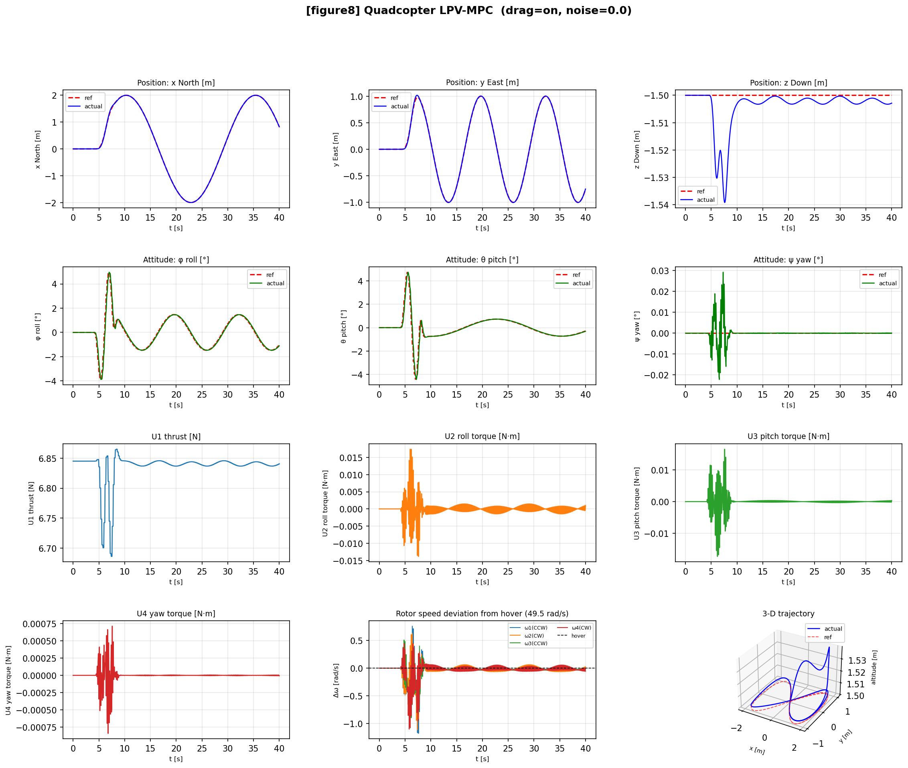
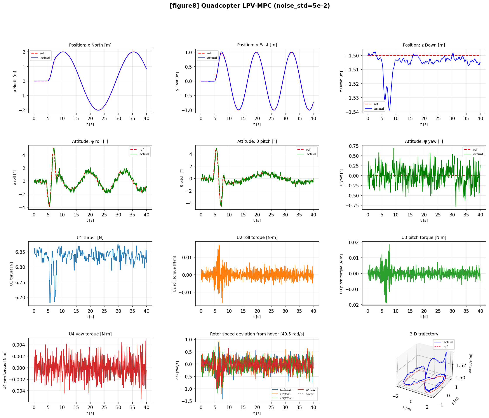
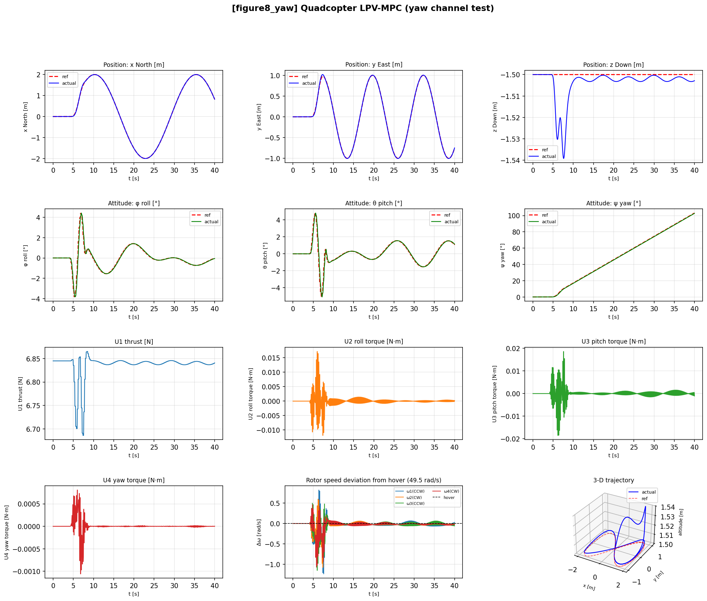

# Quadrotor Feedback Linearization + qLPV-MPC


**A two-level cascade flight controller, pairing exact feedback linearization (position) with quasi-LPV Model Predictive Control (attitude), achieving 6.1 mm position RMSE on a full nonlinear 6-DOF Newton-Euler quadrotor plant, with zero rotor saturation and sub-millisecond QP solve times. Pure Python, verified by an automated regression test suite.**



---

## Highlights

- **Exact feedback linearization** outer loop: geometric thrust-vector inversion with **no small-angle assumption**, valid at any yaw and pitch below 90° (arcsin arguments clipped, angle references limited, and commanded thrust clamped to the physical rotor ceiling)
- **qLPV-MPC** inner loop: re-linearized every sample on measurable scheduling variables, **exact ZOH discretization**, incremental (Δu) formulation with built-in integral action
- **DARE terminal cost**: anchored to the infinite-horizon LQR solution as a formal stability certificate (Rawlings & Mayne, Thm 2.19), with caching that cuts DARE solves from 20 Hz to ~2-5 Hz
- **Constrained QP**: simultaneous absolute torque limits and increment rate limits, solved via `quadprog` (active-set) with a `scipy` fallback
- **Full nonlinear plant**: 12-state Newton-Euler dynamics, RK4 integration, quadratic aerodynamic drag, gyroscopic rotor coupling (J_tp·Ω_net)
- **Regression-tested**: a pytest suite closes the loop on every scenario in ~6 s (see [Testing](#testing))

---

## Results

### Test trajectory

All headline numbers are for a Lissajous figure-8 spanning **4 m × 2 m** at constant altitude, period ≈ 25 s (ω = 0.25 rad/s), flown for 40 s with aerodynamic drag enabled. Peak reference velocity ≈ 0.7 m/s, peak acceleration ≈ 0.25 m/s², entered via a 7th-order minimum-jerk lead-in ramp.

### Nominal figure-8 (drag on, no noise, 40 s)

| Metric | Value |
|--------|-------|
| Position RMSE | **0.0061 m** |
| Position max error | 0.0154 m |
| Attitude RMSE | 0.078° |
| Attitude max error | 0.576° |
| Mean torque norm | 0.00055 N·m |
| Rotor saturations | **0 / 801 steps (0.0 %)** |

### Yaw-sweep validation (ψ ramped at 0.05 rad/s, reaching ~103° over the run)

Exercises the yaw channel and the time-varying A(σ) entries that are dormant when ψ_ref ≡ 0.

| Metric | Value |
|--------|-------|
| Position RMSE | 0.0061 m (unchanged from nominal) |
| Attitude RMSE | 0.421° |
| Attitude max error | 0.715° |
| Rotor saturations | 0 (0.0 %) |

Position tracking is unaffected by the yaw sweep: the qLPV scheduling correctly absorbs the attitude coupling that a fixed linearization would miss.

### Noise robustness (uniform per-state process noise σ = 5e-2)

| Metric | Nominal | Stress (σ = 5e-2) |
|--------|---------|-------------------|
| Position RMSE | 0.0061 m | 0.0283 m |
| Position max error | 0.0154 m | 0.0667 m |
| Rotor saturations | 0 (0.0 %) | 0 (0.0 %) |

Stress-run values vary slightly with the noise realization (observed range ≈ 0.024-0.028 m RMSE across runs); saturation-free operation holds in every run.

### Computational performance

| Metric | Value |
|--------|-------|
| Mean QP solve time | **< 0.3 ms/step** (quadprog active-set; 0.12-0.26 ms observed) |
| Max QP solve time | < 4 ms (first-solve warmup / DARE recomputation steps) |
| DARE recomputation rate | ~2-5 Hz (cached; nominal 20 Hz) |

Timings are wall-clock on a consumer laptop and vary run-to-run with OS scheduling; the relevant conclusion (sub-millisecond solves with large margin to embedded rates) is invariant.

### A note on loop rates (sim-to-real)

The 20 Hz attitude / 5 Hz position rates are an architectural choice, **not a solver limit**: at < 0.3 ms per QP solve, the controller has 15-40x margin to a 200 Hz attitude loop even in pure Python, and far more once the condensed QP is ported to a compiled solver such as OSQP. The formulation is rate-independent; the same controller runs at the 250-500 Hz attitude rates used on embedded flight controllers.

---

## Visualizations

| Nominal figure-8 | Noise robustness | Yaw sweep |
|---|---|---|
|  |  |  |

---

## Controller Architecture

```
trajectory     ┌─────────────────────────────────────────┐
reference  ──► │  OUTER LOOP  (5 Hz)                     │
               │  PositionController                      │
               │  Feedback linearization + pole placement │
               │  Output: phi_ref, theta_ref, U1          │
               └──────────────────┬──────────────────────┘
                                  │
               ┌──────────────────▼──────────────────────┐
               │  INNER LOOP  (20 Hz)                    │
               │  LPVMPCController                        │
               │  qLPV model · ZOH · Δu form · DARE      │
               │  Output: U2, U3, U4                      │
               └──────────────────┬──────────────────────┘
                                  │
               ┌──────────────────▼──────────────────────┐
               │  MIXER  (constant, precomputed)          │
               │  [ω1, ω2, ω3, ω4] = M⁻¹ · U             │
               └─────────────────────────────────────────┘
```

---

## Quick Start

```bash
pip install numpy scipy matplotlib quadprog

python simulate.py                  # figure-8, drag on, no noise
python simulate.py --hover          # hover at (0, 0, -1.5) m
python simulate.py --yaw            # figure-8 with yaw sweep
python simulate.py --no-drag        # disable aerodynamic drag
python simulate.py --noise 1e-3     # add process noise σ=1e-3
python simulate.py --duration 60    # run for 60 seconds
python simulate.py --no-plot        # skip matplotlib output
```

`quadprog` is optional but recommended. Without it the solver falls back to
`scipy` L-BFGS-B, which is slower and encodes absolute input constraints as a
conservative box approximation rather than exact linear constraints.

## Testing

```bash
pip install pytest
python -m pytest test_tracking.py -v      # 4 tests, ~6 s
```

The suite runs the real closed-loop simulation (no mocks) across four scenarios (nominal figure-8, yaw sweep, exact hover, and process-noise stress), asserting finite states, RMSE bounds, and zero rotor saturation. It exists because of a bug that a hover check cannot catch (see the postmortem below), and it fails within seconds if that class of bug is ever reintroduced.

## Repository Structure

```
├── controllers.py     # PositionController (feedback linearization) + LPVMPCController (qLPV-MPC)   ~920 lines
├── dynamics.py        # 6-DOF Newton-Euler plant, RK4 integrator, QuadParams                        ~340 lines
├── simulate.py        # end-to-end simulation runner, metrics, divergence guard, plotting, CLI      ~520 lines
├── utils.py           # rotations, T-matrix, mixer, aero drag, trajectory generators                ~280 lines
├── test_tracking.py   # closed-loop regression suite (pytest, ~6 s)
└── src/figures/       # result plots
```

~2,000 lines, NumPy/SciPy only. Every equation in the deep dive below maps directly to readable code.

---

## Case Study: The Gravity-Sign Regression

At one point this repository shipped with the body-frame gravity projection signs flipped in the horizontal channels (`u̇: +g·sinθ` instead of `−g·sinθ`, `v̇` mirrored). The bug was **invisible in hover**, since sinθ = sinφ = 0 hides both terms, and every hover check passed. The moment the reference moved, the plant's horizontal response inverted relative to what the controller expected, producing positive-feedback divergence: angle references saturated at their limits, altitude error grew, and the unclamped thrust command U1 = m·‖F_W‖ chased it until float overflow (the simulated vehicle reached ~96 km before producing NaNs).

Diagnosis came from the failure signature, not the code: perfect hover, plus divergence that begins exactly when the reference moves, plus the vehicle accelerating *opposite* to the reference in both horizontal axes, points to a sign inversion between controller model and plant. Three hardening measures came out of it, all in this repo:

1. **Maneuver-based regression tests** (`test_tracking.py`): hover tests cannot catch equilibrium-hidden sign errors; only a closed-loop tracking test can.
2. **Thrust clamp**: U1 limited to 90% of the physical rotor ceiling, so the outer loop can never command thrust the vehicle cannot deliver.
3. **Divergence guard**: the simulation aborts with a clear message if any state leaves sane bounds, instead of integrating to overflow.

---

## Technical Deep Dive & Mathematical Formulation

### 1. Outer Loop: Feedback Linearization (Position Control)

The translational dynamics of the quadrotor in the North-East-Down (NED) world
frame are inherently nonlinear and fully coupled by the attitude channels:

```
x_ddot = (U1/m)(cos(psi)*sin(theta)*cos(phi) + sin(psi)*sin(phi))
y_ddot = (U1/m)(sin(psi)*sin(theta)*cos(phi) - cos(psi)*sin(phi))
z_ddot =  g - (U1/m)(cos(theta)*cos(phi))
```

#### Virtual Control and Error Dynamics

To decouple the system, a virtual control vector `v = [vx, vy, vz]` is
introduced as desired world-frame accelerations. A PD tracking law with
feedforward acceleration is applied per axis:

```
v_i = x_ref_ddot_i  +  k2_i * (x_ref_dot_i - x_dot_i)
                     +  k1_i * (x_ref_i     - x_i    )
```

This reduces the plant to three independent double integrators (`x_ddot_i = v_i`),
yielding stable second-order error dynamics:

```
e_ddot  +  k2_i * e_dot  +  k1_i * e  =  0
```

#### Gain Design via Pole Placement

Matching the characteristic polynomial `(s - p1)(s - p2) = s^2 + k2*s + k1`:

```
k1 = Re(p1 * p2)        (proportional gain)
k2 = -Re(p1 + p2)       (derivative gain)
```

Both gains are positive when poles have strictly negative real parts.
Default poles used in simulation:

```
x, y axes :  -1.5 +/- 0.5j   ->  wn = 1.58 rad/s,  zeta = 0.95
z axis    :  -2.0 +/- 0.3j   ->  wn = 2.02 rad/s,  zeta = 0.99
```

The z-axis poles are slightly more aggressive because altitude is decoupled
from roll/pitch and does not risk saturating the inner loop.

#### Exact Angle Inversion (No Small-Angle Assumption)

Unlike simplified models that assume `cos(phi), cos(theta) = 1`, this
implementation uses an exact geometric inversion. The required thrust
magnitude and direction are:

```
F_W   = [vx,  vy,  vz - g]          (desired specific force, NED)
U1    =  m * norm(F_W)               (total thrust, clamped to 90% of
                                      the physical rotor ceiling)
T_hat =  F_W / norm(F_W)             (unit thrust direction)
```

Projecting `T_hat` onto the commanded heading `psi_ref`:

```
Tx_psi =  cos(psi_ref)*T_hat[0] + sin(psi_ref)*T_hat[1]
Ty_psi = -sin(psi_ref)*T_hat[0] + cos(psi_ref)*T_hat[1]
```

The desired angles are then recovered explicitly:

```
theta_ref = arcsin(-Tx_psi)
phi_ref   = arcsin( Ty_psi / cos(theta_ref))
```

Valid for any yaw angle and any pitch below 90 degrees, with no switching
logic needed for `cos(psi) = 0` or `sin(psi) = 0`. For numerical safety the
implementation clips both arcsin arguments to [-1, 1] and limits the
resulting angle references to configurable `phi_max` / `theta_max` bounds,
so aggressive transients degrade gracefully instead of producing NaNs.

---

### 2. Inner Loop: quasi-LPV Model Predictive Control (Attitude)

Rather than solving a slow non-convex Nonlinear MPC problem, the attitude
nonlinearities are embedded into a quasi-Linear Parameter-Varying (qLPV)
representation. The model matrices are updated online using measurable
scheduling variables, keeping the optimization problem convex (QP) at every
step.

#### Scheduling Variables

```
sigma = [phi_dot,  theta_dot,  psi_dot,  Omega_net]
```

Scheduling on Euler rates is consistent with the LPV state vector, which
contains Euler rates. Using body rates `(p, q, r)` instead introduces
O(sin(angle)) cross-coupling error in the A(sigma) entries, approximately
34% at a 20-degree bank angle.

#### State-Space Representation

```
State  :  x_att = [phi, phi_dot, theta, theta_dot, psi, psi_dot]^T   (6x1)
Input  :  u_att = [U2, U3, U4]^T                                      (3x1)
Output :  y     = [phi, theta, psi]^T                                  (3x1)

x_att_dot = A(sigma) * x_att + B * u_att
y         = C * x_att
```

#### A(sigma) Matrix: Non-Zero Entries

```
A[0,1] = 1                                                (phi_dot   = d(phi)/dt)
A[2,3] = 1                                                (theta_dot = d(theta)/dt)
A[4,5] = 1                                                (psi_dot   = d(psi)/dt)

A[1,3] = theta_dot*(Iy-Iz)/Ix - J_tp*Omega_net/Ix        (phi_ddot   <- theta_dot)
A[1,5] = psi_dot*(Iy-Iz)/Ix                              (phi_ddot   <- psi_dot)

A[3,1] = phi_dot*(Iz-Ix)/Iy + J_tp*Omega_net/Iy          (theta_ddot <- phi_dot)
A[3,5] = psi_dot*(Iz-Ix)/Iy                              (theta_ddot <- psi_dot)

A[5,1] = theta_dot*(Ix-Iy)/Iz                            (psi_ddot   <- phi_dot)
A[5,3] = phi_dot*(Ix-Iy)/Iz                              (psi_ddot   <- theta_dot)
```

#### B and C Matrices

```
B[1,0] = 1/Ix    (U2 -> phi_ddot)
B[3,1] = 1/Iy    (U3 -> theta_ddot)
B[5,2] = 1/Iz    (U4 -> psi_ddot)

C = [1 0 0 0 0 0]    (phi)
    [0 0 1 0 0 0]    (theta)
    [0 0 0 0 1 0]    (psi)
```

#### Zero-Order Hold Discretization

The continuous model is discretized exactly at each step using the ZOH method
via the matrix exponential. This preserves the stability of the continuous
system: eigenvalues are mapped from the s-plane via `z = exp(s*dt)`:

```
Ad = expm(A(sigma) * dt)
Bd = (integral from 0 to dt of expm(A(sigma)*tau) dtau) * B
```

Forward Euler is not used, as it can introduce artificial instability when
continuous eigenvalues lie near the imaginary axis.

#### Incremental (Delta-u) Formulation

To introduce integral action and eliminate steady-state tracking error
without manual integrator tuning, the state is augmented with the previous
control input:

```
x_tilde = [x_att;  u_prev]      (9x1 augmented state)
```

The augmented system dynamics become:

```
x_tilde(k+1) = A_tilde * x_tilde(k) + B_tilde * Delta_u(k)
y(k)         = C_tilde * x_tilde(k)

A_tilde = | Ad   Bd |     B_tilde = | Bd |     C_tilde = [Cd  0]
          |  0    I |               |  I |
```

The decision variable is now `Delta_u` (the increment), not `u` directly.
Only the first increment `Delta_u*(0)` is applied each step (receding horizon).

#### Batch QP Formulation

Predicting outputs over horizon N yields:

```
Y = Psi * x_tilde(k) + Theta * Delta_U_bar

Psi[i]     = C_tilde * A_tilde^(i+1)
Theta[i,j] = C_tilde * A_tilde^(i-j) * B_tilde   for j <= i  (lower-triangular)
```

The cost function is:

```
J = (Y - R_ref)^T * Q_bar * (Y - R_ref)  +  Delta_U_bar^T * R_bar * Delta_U_bar
```

Substituting the prediction equation gives the standard convex QP:

```
min   0.5 * Delta_U_bar^T * H * Delta_U_bar  +  f^T * Delta_U_bar

H = Theta^T * Q_bar * Theta + R_bar       (always PD when R_bar > 0)
f = Theta^T * Q_bar * (Psi * x_tilde - R_ref)
```

#### Terminal Weight via DARE

The terminal weight S at step N is computed from the Discrete Algebraic
Riccati Equation (DARE), solved on the original `(Ad, Bd)` matrices:

```
P = Q6 + Ad^T * P * Ad
      - Ad^T * P * Bd * (R + Bd^T * P * Bd)^(-1) * Bd^T * P * Ad
```

where `Q6` is a 6x6 state-space weight derived from the 3x3 output weight Q.
The solution P is then projected to the 3x3 output space:

```
S = C_out * P * C_out^T,    C_out selects rows [phi, theta, psi]
```

This anchors the terminal cost to the infinite-horizon LQR solution, providing
a formal stability certificate for the receding-horizon loop
(Rawlings & Mayne, Theorem 2.19). The DARE solution is cached and only
recomputed when the discrete matrices `(Ad, Bd)` change by more than a
threshold, reducing DARE calls from 20 Hz to approximately 2-5 Hz during
typical flight.

#### Constraints

Two sets of constraints are enforced at every horizon step:

```
-dU_max  <=  Delta_u(k+i)              <=  dU_max    (increment rate limits)
 U_min   <=  u_prev + L*Delta_U_bar    <=  U_max     (absolute torque limits)
```

where L is the block lower-triangular cumulative-sum matrix. The absolute
constraint is rearranged to a form linear in the decision variable:

```
U_min - u_prev  <=  L * Delta_U_bar  <=  U_max - u_prev
```

Default limits used in simulation:

```
U2_max  = 0.45 N·m     dU2_max = 0.18 N·m
U3_max  = 0.45 N·m     dU3_max = 0.18 N·m
U4_max  = 0.12 N·m     dU4_max = 0.05 N·m
```

The QP is solved with `quadprog` (active-set, exact Hessian) when available,
falling back to `scipy` L-BFGS-B otherwise.

---

## Extensions & Future Work

The qLPV structure makes several practically important extensions natural:

- **Payload-varying flight**: extend the scheduling vector σ with online-estimated mass and inertia, so the MPC model tracks payload release (delivery missions) or continuous mass depletion (spraying missions) without redesign. This is the main practical advantage of qLPV over a fixed-linearization MPC.
- **Embedded-rate deployment**: port the condensed QP to OSQP/C; at < 0.3 ms/solve in pure Python, 250-500 Hz attitude rates are already within reach.
- **Software-in-the-loop validation**: close the loop against PX4 SITL (Gazebo) via offboard control to validate the cascade against a production autopilot stack.
- **Quaternion attitude parameterization**: remove the |θ| < 85° Euler restriction for aggressive maneuvering.

---

## References

1. Beard & McLain, *Small Unmanned Aircraft*, Princeton UP, 2012
2. Mahony, Kumar, Corke, *Multirotor Aerial Vehicles*, IEEE Robotics & Automation Magazine, 2012
3. Camacho & Bordons, *Model Predictive Control*, Springer, 2004
4. Rugh & Shamma, *Research on gain scheduling*, Automatica, 2000
5. Rawlings & Mayne, *Model Predictive Control: Theory and Design*, 2009

---

## License

MIT license; see [LICENSE](LICENSE).
